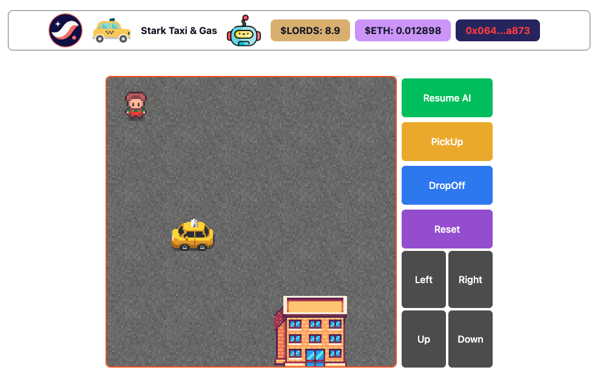

## DOJO Taxi Front-End

This is a Taxi-Pickup game (which is inspired and a remake of the [OpenAI's Gym/Gymnasium TaxiV3](https://gymnasium.farama.org/environments/toy_text/taxi/) game for Reinforcement Learning Tutorials). It uses a simple Q-learning table backend to simulate a possible Reinforcement Learning agent as AI-powered NPC for on-chain games (if combo-ed with ZKML like Giza and EZKL).

The backend has to be powered by our Infra Hack's main Auto-Topper contract [here](https://github.com/Starknet-Infra-Hack-2023/Auto_topper_contracts) and [Paymaster simulation here](https://github.com/Starknet-Infra-Hack-2023/Paymaster-Backend).

